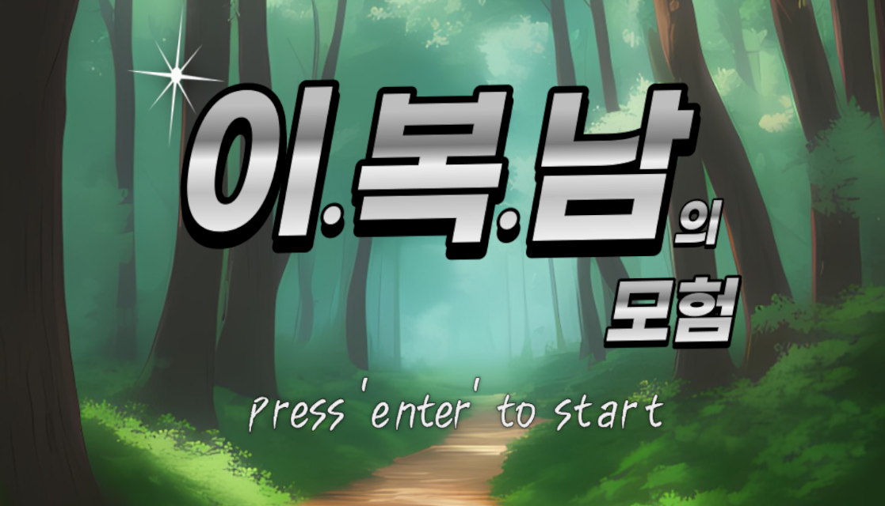
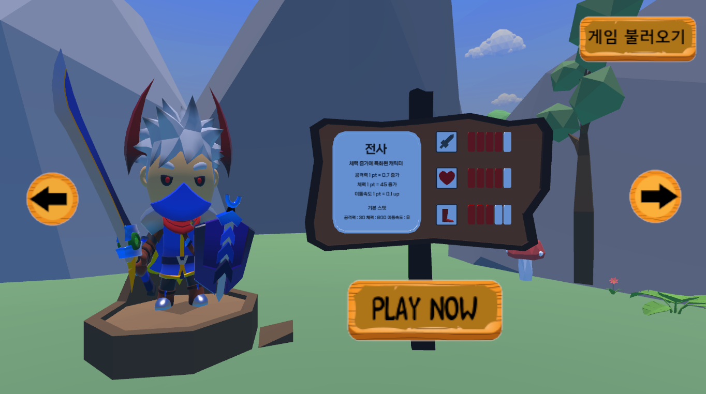
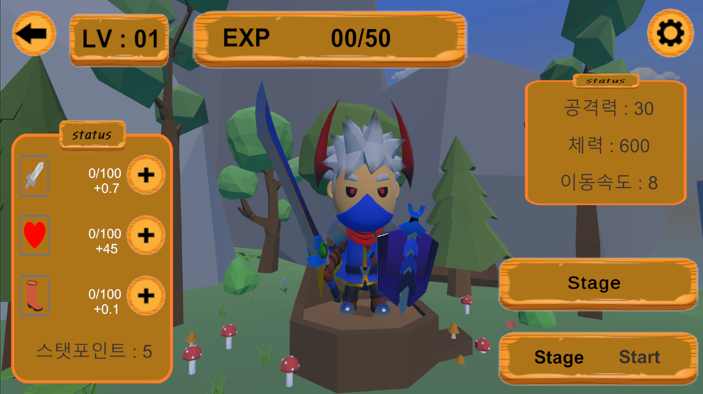
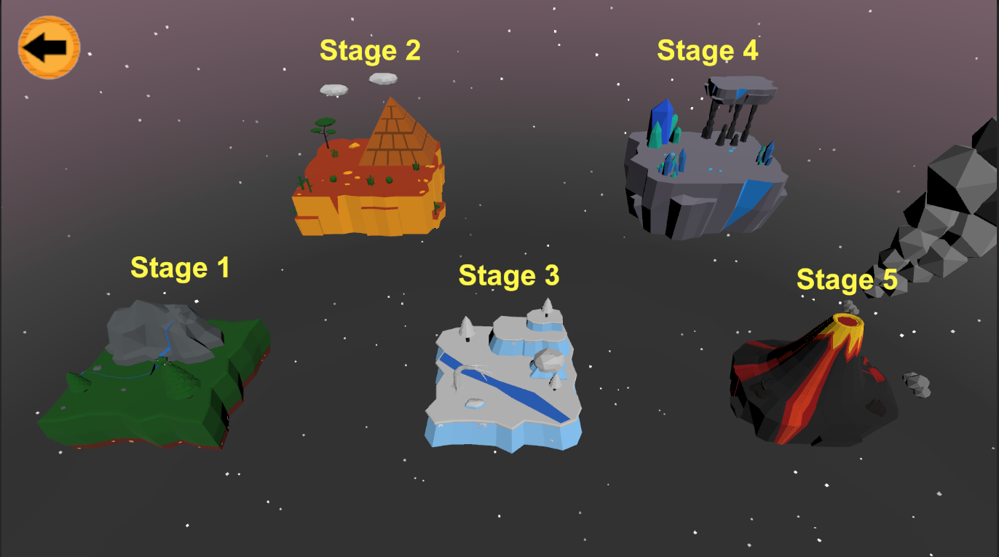
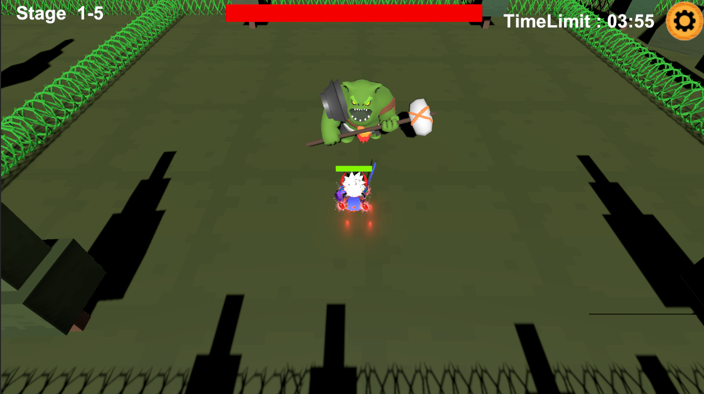

<!-- HEADER --!>

<h1> Lee.Bock.Nam.Adventure </h1>

  

<li> 개발기간: 2023.03.02 ~ 2024.06.21
<li> 개발인원: 기획:1 아트:1 프로그래머:2
<li> 형상관리툴: PlasticSCM

<!-- Contents --!>
<h2 id="table-of-contents"> :book: 목차 </h2>

  
목차

  <ol>
    <li><a href="#about-the-project"> 프로젝트 설명 </a></li>
    <li><a href="#overview"> 게임개요 </a></li>
    <li><a href="#project-files-description"> 프로젝트 파일 </a></li>
    <li><a href="#tech"> 기술/프레임워크 </a></li>
    <li><a href="#screen-shot"> 스크린샷</a></li>
    <li><a href="#download-link"> 게임 다운로드 </a></li>
  </ol>

<h2 id="about-the-project"> 1. 프로젝트 설명 </h2>

<b> 로그라이트RPG </b>

이.복.남의 모험은 로그라이트RPG입니다. 
전사, 궁수, 마법사 직업을 가진 이, 복, 남이 함께 세상 곳곳에 퍼진 몬스터를 물리치기 위해 모험을 떠나는 게임입니다.

<h2 id="overview"> 2. 게임개요 </h2>
. 
<a href="https://github.com/LimHyeongGyun">LimHyeongGyun</a>은 클라이언트 개발을 담당하고 있습니다. 몬스터움직임과 기능, 데이터 저장, 게임시스템 담당하였습니다.

(readme 작성자인 LimHyeongGyun의 파트만 기술 하였습니다.)

<h2 id="project-files-description"> 3. 프로젝트 파일 (Lee.Bock.Nam.Adventure/Assets/) </h2>
<li><b>/Draw</b> - </li>

<h2 id="tech"> 4. 기술/프레임워크 </h2>
<li>Programming </li>
<li>Framework </li>

<h2 id="screen-shot"> 5. 스크린샷</h2>

</a>
</a>
</a>
 

<게임 플레이 사진>

<h2 id="download-link"> 6.게임 다운로드</h2>
<li>https://drive.google.com/drive/folders/19D3dus6XNWp2L040CYFmcEPBjBKrdrGM
